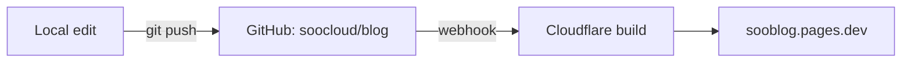
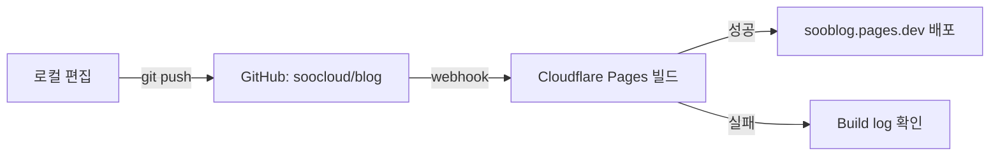

# SooBlog

> Personal tech blog by **Dongsoo** — built with Astro, deployed on Cloudflare Pages.

[](https://sooblog.pages.dev)
[](https://astro.build/)
[](https://github.com/satnaing/astro-paper)

- 🌐 **Live**: <https://sooblog.pages.dev>
- 📦 **Repo**: <https://github.com/soocloud/blog>
- 🗣️ **Languages**: English (default), occasionally Korean / Japanese
- 🕒 **Timezone**: Asia/Tokyo (JST)

---

## 목차

- [기술 스택](#기술-스택)
- [로컬 개발](#로컬-개발)
- [글 작성하기](#글-작성하기)
- [카테고리 정책](#카테고리-정책)
- [수식 쓰기 (KaTeX)](#수식-쓰기-katex)
- [다이어그램 그리기 (Mermaid)](#다이어그램-그리기-mermaid)
- [폴더 구조](#폴더-구조)
- [주요 설정 파일](#주요-설정-파일)
- [배포 워크플로우](#배포-워크플로우)
- [할 일 (TODO)](#할-일-todo)
- [라이선스 / 크레딧](#라이선스--크레딧)

---

## 기술 스택

| 영역 | 사용 기술 |
|---|---|
| 프레임워크 | [Astro](https://astro.build/) v5 (static output) |
| 테마 | [AstroPaper](https://github.com/satnaing/astro-paper) v5.5.1 |
| 스타일 | Tailwind CSS v4 |
| 콘텐츠 | Markdown / MDX + Content Collections |
| 코드 하이라이트 | Shiki (`min-light` / `night-owl`) |
| **수식** | [KaTeX](https://katex.org/) (빌드 시 HTML로 렌더링, 클라이언트 JS 0) |
| **다이어그램** | [Mermaid](https://mermaid.js.org/) (필요한 페이지에서만 lazy-load) |
| 검색 | [Pagefind](https://pagefind.app/) (정적 클라이언트 검색) |
| 호스팅 | [Cloudflare Pages](https://pages.cloudflare.com/) (무제한 대역폭, 무료) |
| CI/CD | GitHub push → Cloudflare 자동 빌드·배포 |

## 로컬 개발

```powershell
# 최초 1회만
npm install

# 개발 서버 (http://localhost:4321)
npm run dev

# 프로덕션 빌드 → dist/
npm run build

# 빌드 결과 미리보기
npm run preview
```

> **요구사항**: Node.js **22.12+** (Cloudflare 빌드 환경 변수 `NODE_VERSION=22`)

## 글 작성하기

새 글은 `src/data/blog/<slug>.md` 또는 `.mdx`로 추가합니다.

### Front matter 템플릿

```markdown
---
author: Dongsoo
pubDatetime: 2026-05-23T10:00:00+09:00   # JST 기준
title: 글 제목
slug: url-slug                            # 파일명과 일치시키는 게 가장 깔끔
featured: false                           # 메인 상단 고정 여부
draft: false                              # true면 빌드에서 제외category: dev                             # cloud | dev | ai | life (필수, 1개)tags:
  - tag1
  - tag2
description: 1~2줄 요약. OG 카드와 RSS에 노출됩니다.
---

본문…
```

### 다국어 표시 규칙 (임시)

기본 사이트 언어는 `en`. 정식 i18n 라우팅(`/ko/`, `/ja/`)은 도입 전이며,
당분간 **태그**로 구분합니다:

| 태그 | 의미 |
|---|---|
| `ko` | 한국어 글 |
| `ja` | 일본어 글 |
| (없음) | 영어 글 |

> 필요 시 [`astro:i18n`](https://docs.astro.build/en/recipes/i18n/) 기반 라우팅으로 마이그레이션 예정.

## 카테고리 정책

글은 **하나의 `category`(상위 분류, 필수) + 자유 `tags`(세부)** 구조로 관리합니다.

| `category` | 레이블 | 의미 | 예시 글 |
|---|---|---|---|
| `cloud` | Cloud | Azure / GCP / AWS 등 퍼블릭 클라우드 | Bicep 구축기, GCP Cloud Run vs Cloud Functions |
| `dev` | Dev | 언어·프레임워크·도구 | TypeScript 타입 트릭, VS Code 설정 |
| `ai` | AI | AI / LLM / 에이전트 | Foundry 소개, RAG 구축기 |
| `life` | Life | 일상·회고·잡담 | 도쿄 생활, 연말 회고 |

**원칙**
- `category`는 반드시 **1개만** 선택. 두 개에 걸치면 더 강한 쪽으로.
- 새 카테고리를 쉬틀게 늘리지 않습니다 (네비게이션 안정성). 추가 필요 시 [`src/content.config.ts`](src/content.config.ts) 의 `CATEGORIES` 배열 수정.
- `tags`는 자유롭게, 많아도 OK (관련 글 탐색·연관 추천에 활용).

브라우징 경로:
- `/categories` — 전체 카테고리 목록
- `/categories/<category>/` — 해당 카테고리의 글 목록 (페이지네이션 포함)
- `/tags`, `/tags/<tag>/` — 세부 관심사 단위

## 수식 쓰기 (KaTeX)

마크다운에서 바로 LaTeX 문법을 쓰면 빌드 시 HTML로 렌더링됩니다 (클라이언트 JS 불필요).

### 인라인

```markdown
아인슈타인의 점질량-에너지 등가 식 $E = mc^2$ 은 유명합니다.
```

### 블록

````markdown
$$
\int_{-\infty}^{\infty} e^{-x^2}\,dx = \sqrt{\pi}
$$
````

> KaTeX 지원 문법은 [공식 문서](https://katex.org/docs/supported.html) 참고.

## 다이어그램 그리기 (Mermaid)

` ```mermaid ` 코드 블록으로 작성. 다이어그램이 있는 페이지에서만 Mermaid 라이브러리(~500KB)가 lazy-load 됩니다.

````markdown

````

> ⚠️ **라벨 따옴표 주의**: 라벨 안에 `:`, `/`, `(`, `)`, `#`, `;` 가 들어가면 **반드시** `"…"` 로 감싸야 합니다. 안 그러면 "Syntax error in text"가 뜨고 다이어그램이 렌더링되지 않습니다.

지원하는 다이어그램 종류는 [Mermaid 공식 문서](https://mermaid.js.org/intro/) 참고:

- `flowchart` / `graph` — 순서도
- `sequenceDiagram` — 시퀀스 다이어그램
- `classDiagram` / `erDiagram` — 클래스 / ER
- `stateDiagram-v2` — 상태 전이
- `gantt`, `pie`, `mindmap`, `timeline` …

> 다크 모드 토글 시 다이어그램이 자동으로 재렌더링됩니다.

### 배포 흐름 (글 1개 올리기)

```powershell
# 1) 글 작성
#    src/data/blog/my-post.md

# 2) (선택) 로컬 확인
npm run dev

# 3) 푸시 → Cloudflare가 자동 빌드·배포
git add .
git commit -m "post: my new article"
git push
```

→ 약 **1~2분 후** <https://sooblog.pages.dev> 에 반영.

## 폴더 구조

```
.
├── public/                  # 정적 자산 (favicon, OG 이미지, robots.txt 등)
├── src/
│   ├── assets/              # 빌드 시 처리되는 이미지·아이콘
│   ├── components/          # 재사용 컴포넌트 (.astro)
│   ├── data/
│   │   └── blog/            # 📝 글이 여기 들어갑니다 (md / mdx)
│   ├── layouts/             # 페이지 레이아웃
│   ├── pages/               # 라우트 (about.md, posts/, tags/ 등)
│   ├── styles/              # 글로벌 CSS
│   ├── utils/               # 유틸 함수 (날짜, slugify, OG 생성 등)
│   ├── config.ts            # ⭐ 사이트 메타 설정
│   ├── constants.ts         # ⭐ 소셜 링크
│   └── content.config.ts    # 콘텐츠 컬렉션 스키마
├── astro.config.ts          # Astro / Vite / 마크다운 설정
├── package.json
└── tsconfig.json
```

## 주요 설정 파일

| 파일 | 무엇을 바꿀 때 |
|---|---|
| [`src/config.ts`](src/config.ts) | 사이트 제목, 작성자, 설명, 언어, 타임존, OG 이미지 파일명 |
| [`src/constants.ts`](src/constants.ts) | 헤더·푸터 소셜 링크 (GitHub, Mail 등) |
| [`src/pages/about.md`](src/pages/about.md) | About 페이지 본문 |
| [`astro.config.ts`](astro.config.ts) | Astro 통합, Vite 플러그인, Shiki 테마 |
| [`public/`](public/) | favicon, OG 기본 이미지, robots.txt |

## 배포 워크플로우



### Cloudflare Pages 빌드 설정 (이미 적용됨)

| 항목 | 값 |
|---|---|
| Production branch | `main` |
| Framework preset | Astro |
| Build command | `npm run build` |
| Build output directory | `dist` |
| Environment variable | `NODE_VERSION=22` |

> 미리보기 배포: `main` 외 브랜치/PR도 자동으로 임시 URL 발급됨.

## 할 일 (TODO)

### 🔧 자질구레한 마무리

- [ ] [`public/favicon.svg`](public/favicon.svg) / `favicon.ico` 본인 파비콘으로 교체

### 🚀 기능 확장

- [ ] **Giscus** 댓글 (GitHub Discussions 기반, 무료)
- [ ] **Cloudflare Web Analytics** 연결 (쿠키리스, 무료)

### 🌐 다국어 본격 도입

- [ ] `/ko/`, `/ja/` URL 라우팅
- [ ] 언어 전환 UI
- [ ] `hreflang` 메타 태그

### 🏷️ 도메인 (선택)

- [ ] 커스텀 도메인 구매 + Cloudflare DNS 연결

## 라이선스 / 크레딧

- 테마: [AstroPaper](https://github.com/satnaing/astro-paper) by **Sat Naing** — MIT License
- 글 콘텐츠: © Dongsoo. 별도 표기가 없는 한 무단 전재 금지.
