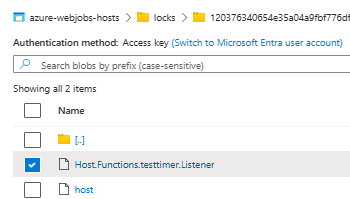
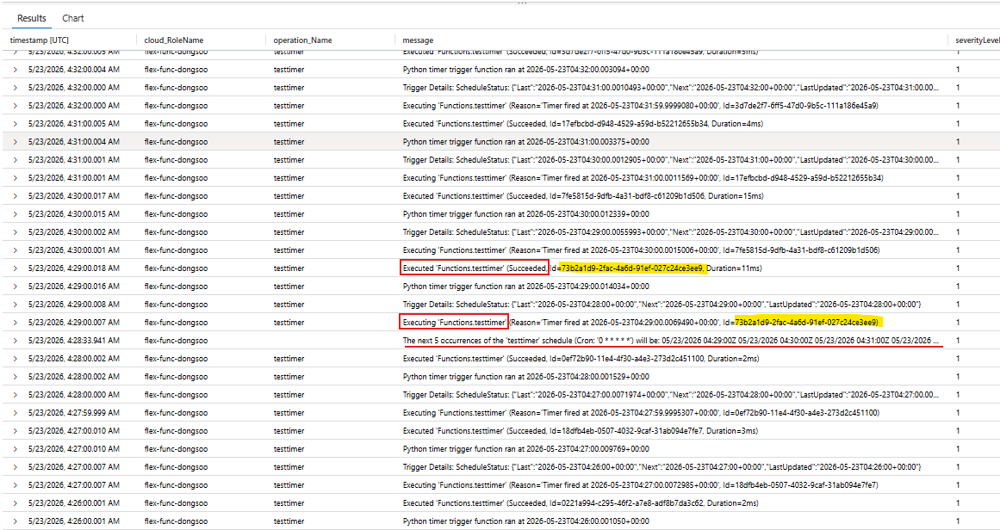
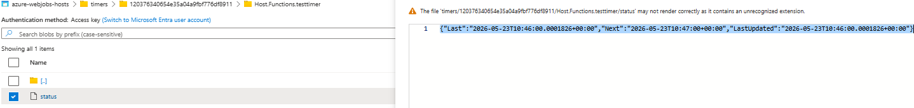
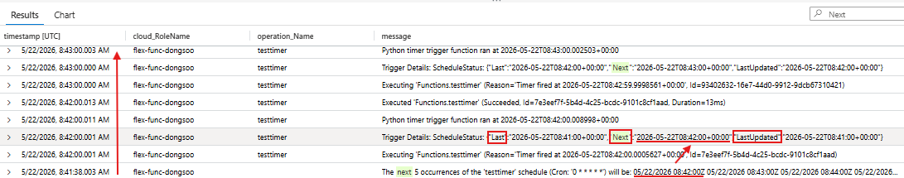

## Intro
아무래도 PaaS 환경에서 인스턴스가 재기동되거나, 교체되는 경우가 있다보니, Timer Trigger 의 미실행, 처리실패 등과 관련하여 트러블슈팅하는 경우가 빈번하다. 이번 글에는 Timer Trigger 의 동작방식, 트러블슈팅 사례, 그 방법 등을 다뤄보고자 한다.

## Timer Trigger 란?
Azure Functions 에는 다양한 트리거가 있는데, 이번에는 Timer Trigger에 다뤄보고자 한다.
Timer Trigger는 배치 처리 등 Cron 식으로 지정한 스케줄에 따라 실행되는 함수이다.

## Singleton Lock

특정 시점에 1개 인스턴스에만 처리가 움직이는 것을 의미한다. Timer Trigger는 Blob 컨테이너에 Trigger 마다 배치된 파일Lock 을 취득한 인스턴스에만 동작한다. 즉, 인스턴스가 여러가 존재해도 그 중 하나의 인스턴스만 Lock 을 취득해서 Timer Trigger가 실행되도록 제어한다. 해당 파일은 보통 `AzureWebJobsStorage` 에 지정한 Storage Account 의 Blob 컨테이너에 `azure-webjobs-hosts/locks/azure-webjobs-hosts/locks/Host.Functions.<트리거명>.Listener` 으로 존재한다.


## 작성 예 (Python)
```python
import logging
import azure.functions as func

@app.function_name(name="testtimer")
@app.timer_trigger(
    schedule="0 */1 * * * *",
    arg_name="mytimer",
    run_on_startup=False,
    use_monitor=True,
)
def testtimer(mytimer: func.TimerRequest) -> None:
    utc_timestamp = datetime.datetime.now(datetime.timezone.utc).isoformat()

    if mytimer.past_due:
        logging.info("The timer is past due!")

    logging.info("Python timer trigger function ran at %s", utc_timestamp)
```

## 실행 로그 확인
기본적으로, 여느 함수와 같이 Application Insights 의 traces 테이블에서 아래와 같이 확인할 수 있다.

- 실행 시작 : Executing 'Functions.[함수명]'
- 처리 완료 : Executed 'Functions.[함수명]' (Succeeded, ...)
- 처리 실패 : Executed 'Functions.[함수명]' (Failed, ...)



여기서 특이한 점은, `The next 5 occurrences of the 'testtimer' schedule (Cron: '0 * * * * *') will be: 05/23/2026 04:29:00Z ` 에서와 같이, 해당 Timer Trigger가 실행될 다음 5개 시간대를 보여준다.

## Troubleshooting Cases
1. 예정된 시간에 실행되지 않은 경우
   1. Possible root causes
      - 실행이 예정된 시간에 기반 인스턴스가 메인테넌스 등으로 교체/재기동 됨
      - Storage Account 와의 네트워크 문제
      - 내부 Scale Controller 상의 문제
      - 동일 인스턴스 상에서 다른 함수의 실행이 종료되지 않은 경우

   2. Actions
      - `UseMonitor` 프로퍼티 설정<br>
      Timer Trigger에 지정하는 프로퍼티 중 하나로, true (실행 주기가 1분 이상인 경우 기본값 true) 인 경우, Blob 컨테이너에 동작을 텍스트파일 형태로 기록해서, 기동시에 해당 파일을 참조, Timer Trigger를 실행할지말지를 판단한다. 해당 파일은 보통 `AzureWebJobsStorage` 에 지정한 Storage Account 의 Blob 컨테이너에 `azure-webjobs-hosts/timers/<함수HostID>/Host.Functions.<함수명>/status` 으로 존재한다. 
       
      Application Insights 의 traces로그에서도 확인 가능하다.

      

      위에서 보이듯, Last, Next, LastUpdated 로 나뉜다. 이 때 Next 의 시간이 로그의 Next 5 Occurrences 에 표시된 다음 시간보다 이전일 경우, UseMonitor 가 True 인 경우, Timer Trigger가 실행된다. 이때 로그에는 `Function 'TimerTrigger' is past due on startup. Executing now.` `Trigger Details: UnscheduledInvocationReason: IsPastDue, OriginalSchedule: ...` 이 기록된다.

2. 예정되지 않은 시간에 실행된 경우
   1. Possible root causes
      - UseMonitor 에 의한 의도된 동작
