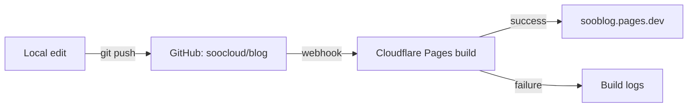

> If I don't write it down, I forget it.

## Why another blog

Notes that live in chat threads, internal wikis, or random Notion pages
have a way of disappearing exactly when I need them again.
So this time I'm putting them on a **public static site** I actually own.

## What I'll write about

- ☁️ Cloud, mostly Azure
- 🤖 AI and agent development
- 🌐 Web development, dev environment, tooling
- 📝 The occasional off-topic note

Long-form is the default. Diagrams, tables and code snippets show up whenever
they're the clearer way to explain something.

## Languages

The site is in **English** by default, but posts can be in **Korean** or
**Japanese** when that fits the topic or the audience better.

## Stack

- [Astro](https://astro.build/) + [AstroPaper](https://github.com/satnaing/astro-paper) theme
- Deployed on [Cloudflare Pages](https://pages.cloudflare.com/)
- Content lives in [GitHub](https://github.com/soocloud/blog)

Starting small and adding features only when I actually need them.

## What this blog can render

### Diagrams (Mermaid)

### Math (KaTeX)

Inline: $E = mc^2$

Block:

$$
\int_{-\infty}^{\infty} e^{-x^2}\,dx = \sqrt{\pi}
$$

— Dongsoo

