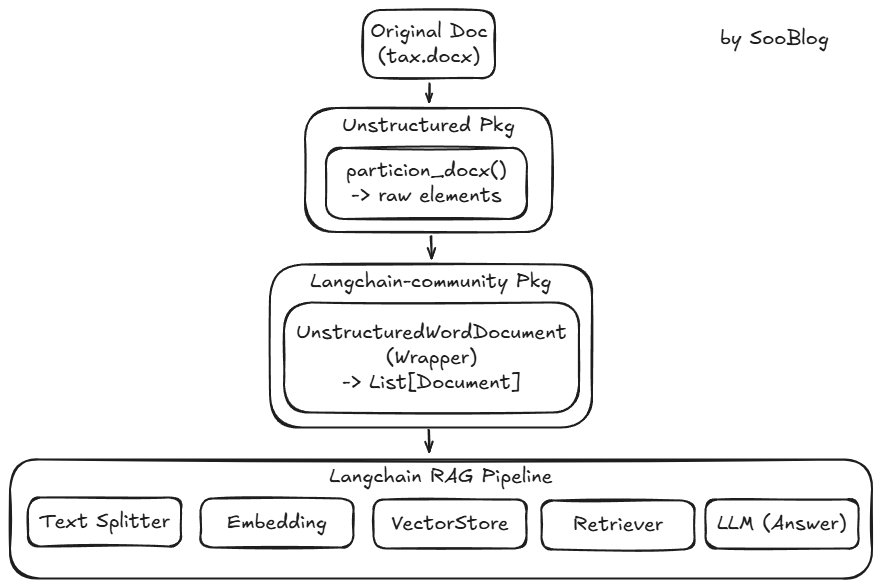

## RAG
Retrieval Augmented Generation
1. Retrieval : 언어모델이 가지고 있지 않은 데이터를 컴퓨터 시스템 (Vector Store) 으로부터 가져오는 것 
2. Augmented : Retrieval된 데이터를 LLM 이 아는 것처럼 생성함.
=> 여기까지가 개발자의 역할이다. Generation 부터는 LLM 모델의 영역.

## Vector
1. Embedding 모델을 이용해서 Vector를 생성한다.
2. 이때 한국어는 Upstage 의 Embedding 모델 OpenAI의 Embedding 모델보다 낫다.

## Vector Database
Vector Store
1. 답변을 생성할 때 필요한 데이터. 즉, 사용자의 질문과 관련있는 데이터.
   - 관련성 = Vector. 단어나 문장의 유사도로 관련성을 파악.
3. Embedding 모델을 활용해서 Vector를 생성
   - Embedding 모델: 비슷한 단어가 자주 붙어서 나오는 경우, 유사할 가능성이 높다고 파악. 
   - https://projector.tensorflow.org/
3. Embedding 모델을 통해 생성된 Vector 데이터와, 출처의 문서 이름 등의 정보를 저장된 Database

## Vector 유사도
cosine_similarity(wordA_vector, wordB_vector)

## 환경설정
1. Python venv
2. OpenAI API Key 획득 https://platform.openai.com/home
3. 워크스페이스에 .env 파일만들어서아래와 같이 붙여넣자.
`OPENAI_API_KEY=sk-proj-oZ5pgze024aTDQLBfF3a4...`
4. 테스트를 위한 test.ipynb 파일을 만들고, `%pip install langchain-openai python-dotenv` 를 입력, 실행<br>
(이때, Jupyter 노트북을 돌리기위해 ipykernel 패키지가 필요하다는 말이 나온다. 추후 streamlit 에 배포할 때는 필요없지만 일단 연습용으로 써야하니 인스톨)
5. 그리고 다음과 같은 코드로 테스트해볼 수 있음
```python
from dotenv import load_dotenv
load_dotenv()

from langchain_openai import ChatOpenAI
llm = ChatOpenAI() # 이 때 환경변수 OPENAI_API_KEY 가 있는지 확인. 없으면 import os 해서 직접 가져와서 인수로 넣어줘야함.

ai_message = llm.invoke("한국의 수도는?") # 여기서 Token 체크 들어감
print(ai_message.content) # 답변 출력
```

(Upstage를 사용하는 경우)
```python
%pip install python-dotenv langchain-upstage
from dotenv import load_dotenv
load_dotenv()
from langchain_upstage import ChatUpstage
llm = ChatUpstage()
ai_message = llm.invoke("한국의 수도는?")
```

## 소득세법으로 RAG 하기
1. 소득세법 word 파일 다운로드하고, 파일형식을 docx 로 바꾸기 (rtf가 아님)
2. 문서내용을 읽는다. (by [Langchain DocumentLoader](https://docs.langchain.com/oss/python/integrations/document_loaders/unstructured_file))

```python
%pip install --upgrade --quiet "unstructured[docx]" langchain-community
from langchain_community.document_loaders import UnstructuredWordDocumentLoader

loader = UnstructuredWordDocumentLoader("./text.docx")
document = loader.load()
#print(document[0].page_content) -> 길이가 1인 리스트로 반환됨. document[0]은 Document 객체임. document[0].page_content는 text.docx 파일의 내용을 문자열로 반환함.
```
   - `langchain_community` 는 내부적으로 `unstructrued`를 호출한다. 따라서 unstructured 가 설치되어있지 않으면 런타임 에러.
   - `unstructured` : 실제 docx 파일을 열어서 텍스트/표/제목을 뽑아냄
   - `langchain_community` : 위의 unstructured 엔진을 LangChain 표준 규격(다른 파일형식과 동일하게) 에 맞게 감싸줘서 Langchain RAG 파이프라인에 들어갈 수 있게 함. [^1]

3. 문서를 쪼갠다. (by [Recursive Text Spliiter](https://docs.langchain.com/oss/python/integrations/splitters/recursive_text_splitter))
    - Resursive 는 텍스트를 더 다양한 인자를 기준으로 쪼갤 수 있다.
    - chunk_size : 1개의 chunk 가 가질 토큰의 사이즈 (텍스트 크기)
    - chunk_overlap : 위 chunk 가 조금씩 겹치게해서, 각 chunk 간의 유사성을 파악할 수 있게함(정확도 향상) 
```python 
%pip install -qU langchain-text-splitters
from langchain_community.document_loaders import UnstructuredWordDocumentLoader
from langchain_text_splitters import RecursiveCharacterTextSplitter

text_splitter = RecursiveCharacterTextSplitter(chunk_size=1500, chunk_overlap=200) 

loader = UnstructuredWordDocumentLoader("./text.docx")
document_list = loader.load_and_split(text_splitter=text_splitter) 
```

4. 임베딩
```python
from dotenv import load_dotenv
from langchain_openai import OpenAIEmbeddings

load_dotenv()
embeddings = OpenAIEmbeddings(model="text-embedding-3-large") #디폴트 모델 : text-embedding-ada-002
```

5. VectorStore 에 저장 (by [Chroma](https://docs.langchain.com/oss/python/integrations/vectorstores/chroma))
```python
%pip install -qU langchain-chroma
from langchain_chroma import Chroma
database = Chroma.from_documents(documents=document_list, embedding=embeddings)
```
   - Chroma : Vector Database, Inmemory 라서 간단하다.
   - 만약 in-memory 이기 때문에 embedding 한 데이터를 persist directory 에 저장하고 싶다면, 아래와 같이 설정 가능하다.
```python
from langchain_chroma import Chroma
database = Chroma.from_documents(documents=document_list, embedding=embeddings, persist_directory="./chroma_db", collection_name="tax_documents")
#./chroma_db 에 embedding  결과를 저장한다.
#저장된 컬렉션 명은 tax_documents가 된다.
```


6. 유사도 검색으로 Retrieval -> LLM 에 쿼리 
```python
query = "연봉 1억원인 직장인의 소득세는 얼마인가요?"
retrieved_docs = database.similarity_search(query, k=3) #k는 반환할 유사한 문서의 개수

from langchain_openai import ChatOpenAI
llm = ChatOpenAI(model="gpt-4o") #디폴트 모델 : gpt-3.5-turbo

prompt = f"""
[Identity] 
- 당신은 세금 전문가입니다. 
- [Context] 를 참고해서 사용자의 질문에 답변해 주세요. 

[Context]
{retrieved_docs}

Question: {query}
"""

ai_message = llm.invoke(prompt)
print(ai_message.content)
```


## Improve Retrieval
1. 검증된 프롬프트를 활용하는 방법
```python
%pip install -qU langchainhub langsmith
from langsmith import Client
client = Client()
prompt = client.pull_prompt(  #LangSmith에서 프롬프트를 가져오는 메서드
    "rlm/rag-prompt",
    include_model=False,
    dangerously_pull_public_prompt=True, #공개된 프롬프트를 가져올 때 경고 메시지를 표시하지 않도록 설정
)
```
(반환된 prompt 의 template 부분 발췌)
```
template="You are an assistant for question-answering tasks. Use the following pieces of retrieved context to answer the question. If you don't know the answer, just say that you don't know. Use three sentences maximum and keep the answer concise.\nQuestion: {question} \nContext: {context} \nAnswer:"
```

2. QA 체인만들기, LCEL 적용
```python
from dotenv import load_dotenv
from langchain_chroma import Chroma
from langchain_openai import ChatOpenAI, OpenAIEmbeddings
from langchain_core.prompts import ChatPromptTemplate
from langchain_core.runnables import RunnablePassthrough
from langchain_core.output_parsers import StrOutputParser

load_dotenv()
embeddings = OpenAIEmbeddings(model="text-embedding-3-large")

# 1. 벡터 DB 다시 열기
database = Chroma(
    collection_name="tax_documents",
    persist_directory="./chroma_db",
    embedding_function=embeddings,
)

# 2. Retriever — k 를 10 으로 늘려 세율표 청크가 잡힐 확률 ↑
retriever = database.as_retriever(search_kwargs={"k": 10})

# 3. 한국어 RAG 프롬프트 (영어 rlm/rag-prompt 대체 — 보수적 거절 줄임)
prompt = ChatPromptTemplate.from_template("""
당신은 한국 세무 전문가입니다. 아래 [참고 문서]를 근거로 사용자의 질문에 답변하세요.
- 세율, 금액, 조건 등이 [참고 문서]에 있으면 구체적 수치와 계산 과정을 단계별로 보여주세요.
- 부분 정보만 있어도 그 범위 안에서 최대한 답변하세요.
- 정말로 관련 정보가 전혀 없을 때만 "참고 문서에서 해당 정보를 찾을 수 없습니다"라고 답하세요.

[참고 문서]
{context}

[질문]
{question}
""")

# 4. LLM
llm = ChatOpenAI(model="gpt-4o")

# 5. 검색된 Document 리스트를 하나의 문자열로 합치는 헬퍼
def format_docs(docs):
    return "\n\n".join(d.page_content for d in docs)

# 6. LCEL 체인 조립: 질문 → (검색+질문 dict) → 프롬프트 → LLM → 텍스트
rag_chain = (
    {
        "context": retriever | format_docs,
        "question": RunnablePassthrough(),
    }
    | prompt
    | llm
    | StrOutputParser()
)


query = "연봉 1억원인 직장인의 소득세는 얼마인가요?"

print("=== 답변 ===")
answer = rag_chain.invoke(query)
print(answer)
```

------------------------------


[^1]: 해당 내용을 그래프로 나타내면 아래와 같다.


