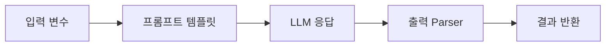

## 인트로
해당 포스트는 wikidocs의 LangChain 입문부터 응용까지라는 자료를 독학하면서 정리한 노트입니다.

## LangChain 1.0
기존 chain 중심에서 agent 중심의 프레임워크로 재설계됨.
1. 프레임워크 구성요소 (패키지)
   - langchain : 메인패키지. 에이전트생성, 모델초기화, 도구정의
   - langchain-core : 메시지, 프롬프트, Runnable 등 기본 추상화와 인터페이스 제공
   - Provider패키지 : 각 LLM 제공자의 통합 (langchain-openai, langchain-anthropic, langchain-google-genai 등)
   - langgraph : 에이전트의 실행 런타임 제공. `create_agent` 로 생성된 에이전트가 LangGraph 위에서 동작. 오케스트레이션 프레임 워크.
   - langsmith : 에이전트의 실행을 추적, 디버깅, 평가하는 플랫폼

2. 예시
```python
from langchain.agent import create_agent
from langchain.chat_models import init_chat_model
from langchain.tools import tool

# 도구: 검색
@tool
def search_web(query: str) -> str:
    return f"'{query}'에 대한 검색결과입니다."

# 도구: 계산
@tool
def calculate(expression: str) -> str:
    return str(eval(expression))

# 에이전트 생성 - 위 두개의 도구를 사용
agent = create_agent(
    model = init_chat_model("gpt-4o-mini")
    tools=[search_web, calculate],
    system_prompt = "역할정의: 너는 웹 검색과 계산을 도와주는 AI Agent 야."
)

# 에이전트 실행
result = agent.invoke({
    "messages": [{"role": "user", "content": "2025년 한국 GDP는 얼마야?"}]
})
```

3. 달라진점
   - LangGraph 내장됨.
   - 모델 초기화가 개별 호출이 아닌, init_chat_model() 로 통합
   - 진입점이 create_agent 로 됨.


## Chain / Multi-Chain
1. Chain?


2. 예시
```python
from dotenv import load_dotenv
from langchain.chat_models import init_chat_model
from langchain_core.prompts import ChatPromptTemplate
from langchain_core.output_parsers import StrOutputParser

load_dotenv()

# Input
topic = input("What topic do you want to learn about?")

# Prompt template
prompt = ChatPromptTemplate.from_template(
    "Explain this {topic} simply."
)

# LLM
llm = init_chat_model("gpt-4o-mini")

# Chain(LCEL)
chain = prompt | llm | StrOutputParser()

# Result
response = chain.invoke({"topic": topic})
print(response)
```
