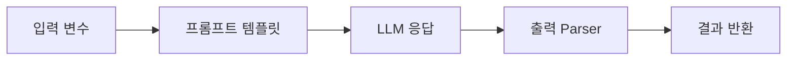

## 인트로
해당 포스트는 wikidocs의 LangChain 입문부터 응용까지라는 자료를 독학하면서 정리한 노트입니다.

## LangChain 1.0
기존 chain 중심에서 agent 중심의 프레임워크로 재설계됨.
1. 프레임워크 구성요소 (패키지)
   - langchain : 메인패키지. 에이전트생성, 모델초기화, 도구정의
   - langchain-core : 메시지, 프롬프트, Runnable 등 기본 추상화와 인터페이스 제공
   - Provider패키지 : 각 LLM 제공자의 통합 (langchain-openai, langchain-anthropic, langchain-google-genai 등)
   - langgraph : 에이전트의 실행 런타임 제공. `create_agent` 로 생성된 에이전트가 LangGraph 위에서 동작. 오케스트레이션 프레임 워크.
   - langsmith : 에이전트의 실행을 추적, 디버깅, 평가하는 플랫폼

2. 예시
```python
from langchain.agent import create_agent
from langchain.chat_models import init_chat_model
from langchain.tools import tool

# 도구: 검색
@tool
def search_web(query: str) -> str:
    return f"'{query}'에 대한 검색결과입니다."

# 도구: 계산
@tool
def calculate(expression: str) -> str:
    return str(eval(expression))

# 에이전트 생성 - 위 두개의 도구를 사용
agent = create_agent(
    model = init_chat_model("gpt-4o-mini")
    tools=[search_web, calculate],
    system_prompt = "역할정의: 너는 웹 검색과 계산을 도와주는 AI Agent 야."
)

# 에이전트 실행
result = agent.invoke({
    "messages": [{"role": "user", "content": "2025년 한국 GDP는 얼마야?"}]
})
```

3. 달라진점
   - LangGraph 내장됨.
   - 모델 초기화가 개별 호출이 아닌, init_chat_model() 로 통합
   - 진입점이 create_agent 로 됨.


## Chain
1. Chain?



2. 구성요소
   - LLM 모델 인스턴스 생성

   (방식1)
   ```python
   from langchain.chat_models import init_chat_model
   llm = init_chat_model("gpt-4o-mini")
   llm.invoke("질문")
   ```

   (방식2)
   ```python
   from langchain_openai import ChatOpenAI
   llm = ChatOpenAI(model = "gpt-4o-mini")
   llm.invoke("질문")
   ```

   - prompt
   ```python
   #튜플 (role, template) 을 주로 쓴다. role 은 "system" | "human" | "ai" | "placeholder"
   prompt = ChatPromptTemplate.from_messages([
       ("system", "You are an expert in astronomy, and you explain things in 3 sentences."),
       ("user", "{question}")
   ])
   ```
   

3. 예시
```python
from dotenv import load_dotenv
from langchain.chat_models import init_chat_model
from langchain_core.prompts import ChatPromptTemplate
from langchain_core.output_parsers import StrOutputParser

load_dotenv()

# Input
topic = input("What topic do you want to learn about?")

# Prompt template
prompt = ChatPromptTemplate.from_template(
    "Explain this {topic} simply."
)

# LLM
llm = init_chat_model("gpt-4o-mini")

# Chain(LCEL)
chain = prompt | llm | StrOutputParser()

# Result
response = chain.invoke({"topic": topic})
print(response)
```

* 물론 그냥 prompt 없이, chain 형성 없이 모델만으로 실행하려면, `llm.invoke("인풋")` 해서 답을 받을 수도 있다.


## Multi-Chain
1. Multi-Chain?
   LCEL을 사용해서, 다수의 체인을 연결하거나 병렬 실행해서 복잡한 워크플로우 구성하는 패턴
   - 순차연결 : 파이프 (|), 앞의 결과물은 다음체인의 input으로 활용
   ```python
   chain = A | B | C
   ```
   - 병렬처리 : `RunnableParallel` 
   ```python
   chain = RunnableParallel(a=A, b=B)
   ```
   - 조건부 분기  *ex. 언어별 다른 프롬프트 쓸 때.
   ```python
   chain = RunnableBrance(...)
   ```
   - 체인간 데이터 전달

2. 순차연결 
(예시)
```python
from langchain.chat_models import init_chat_model
from langchain_core.prompts import ChatPromptTemplate
from langchain_core.output_parsers import StrOutputParser

llm = init_chat_model("gpt-4o-mini")

# 1단계: 한국어를 영어로 번역
translate_prompt = ChatPromptTemplate.from_template(
    "다음 한국어를 영어로 번역하세요: {korean_word}"
)

# 2단계: 영어 단어 설명
explain_prompt = ChatPromptTemplate.from_template(
    "다음 영어 단어를 한국어로 자세히 설명하세요: {english_word}"
)

# 체인 1: 번역
chain1 = translate_prompt | llm | StrOutputParser()

# 체인 2: 번역 결과를 입력으로 사용
chain2 = (
    {"english_word": chain1}
    | explain_prompt
    | llm
    | StrOutputParser()
)

# 실행
result = chain2.invoke({"korean_word": "인공지능"})
print(result)
```

(다단계 순차 체인)
TBD


## Runnable
1. 체인 실행방법 - `Runnable` 프로토콜
   - LangChain 의 Runnable 프로토콜은 사용자가 체인을 생성/관리/파이프라인 구성하기 위한 인터페이스를 제공한다.
   - 종류
      - invoke: 주어진 입력에 대한 체인 호출, 결과 반환. 단일 입력에 동기적 작동
      - batch: 리스트 입력 -> 결과 리스트 반환. 여러 입력에 대해 동기적 작동.
      - stream: 입력에 대해 체인 호출하고, 결과를 스트림. 실시간 데이터 처리에 유용.
      - 비동기 버전: `ainvoke` `abatch` `astream` 등의 메소드로 비동기 실행 지원.

2. Custom Chain 생성과정
   1. 컴포넌트(프롬프트, llm, 파서 등) 정의하고, 각각 Runnable 인터페이스를 구현
   2. 컴포넌트를 조합해 체인 생성
   3. 체인을 실행

```python
from dotenv import load_dotenv
from langchain.chat_models import init_chat_model
from langchain_core.prompts import ChatPromptTemplate
from langchain_core.output_parsers import StrOutputParser

# 0.환경변수 로드
load_dotenv()

# 1.컴포넌트 초기화
prompt = ChatPromptTemplate.from_template("You are the expert of Azure. Explain simply about the {topic} in 3 sentences.")
llm = init_chat_model("gpt-4o-mini")
output_parser = StrOutputParser()

# 2. 체인 구성
chain = prompt | llm | output_parser

# 3-1. 체인실행 - invoke()
print(chain.invoke({"topic": "Container Apps"}))

# 3-2. 체인실행 - batch()
topics = ["App Service", "Azure Functions", "Azure Kubernetes Service"]
results = chain.batch([{"topic": topic} for topic in topics])
for topic, result in zip(topics, results):
    print(f"Topic: {topic}\nExplanation: {result}\n")

# 3-3. 체인실행 - stream()
stream = chain.stream({"topic", "Azure Cosmos DB"})
for token in stream:
    print(token, end="", flush=True)    
```

