# Intro
Azure Functions 는 Language Woker process 와 host process 양 쪽에서 함수 실행에 대한 Telemetry 데이터 (로그 등)을 생성한다. 둘 다 기본적(by default)으로 Application Insights SDK 를 사용해서 Application Insights (AI) 로 보낸다. 
한편, AI SDK 가 아닌, OpenTelemetry(OTEL) 를 사용해서 Telemetry 데이터를 보내는 방식이 존재한다.
이번 글에서는 그 방식의 설정방법과, 실제 로그 상에서 어떻게 달라지는지를 보이려한다. 

이때 Host 와 Language worker 프로세스 각각에 대해서 Application Insights SDK 가 아니라 OTEL 를 사용하도록 설정할 수 있다. 
* 둘 다 설정하거나, 한쪽만 설정해서 한쪽은 Applicaiton Insights SDK, 다른 쪽은 OTEL을 사용하도록 설정할 수 있다.

traces 테이블에서보는 host 수준 로그 예시
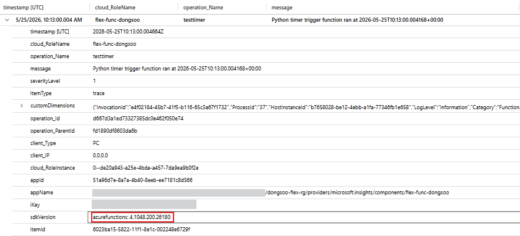
app 수준 로그 예시
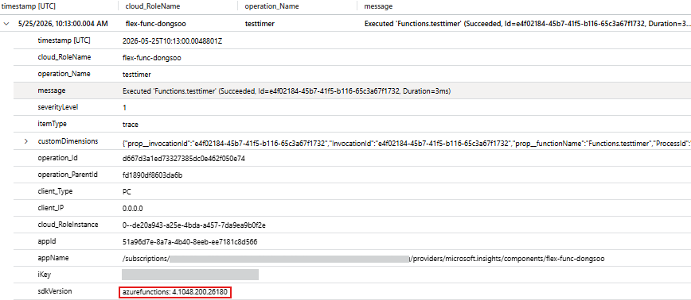


  // "telemetryMode": "OpenTelemetry",
# 방법
1. Host process 에 대해 설정 
(Host 레벨에서만 OTEL, Language Woker 는 여전히 AI SDK.)
host.json에 아래 추가
```json
{
  "version": "2.0",
  "telemetryMode": "OpenTelemetry",
  ...
}
```
5/25 19:20 JST 다시 배포


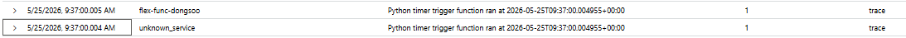

2. Language Woker process 에 대해 설정
(Language Woker 에만 OTEL, Host 레벨에서는 여전히 AI SDK.)


# 장점
1. OpenTelemetry 형식이라서 AI 외에도 OpenTelemetry 를 호환하는 다른 엔드포인트로도 보낼 수 있다.
2. 


#참고문서
https://learn.microsoft.com/en-us/azure/azure-functions/opentelemetry-howto?tabs=app-insights%2Cihostapplicationbuilder%2Cmaven&pivots=programming-language-python#enable-opentelemetry-in-the-functions-host


----------

현시점 내이해
보통이라면, Worker 레벨에서 로그는 Host 파이프라인을 통해 Application Insights 로 전달된다.
따라서 host.json 에서 "telemetryMode": "OpenTelemetry", 하면 Host 파이프라인은 AI SDK 를 사용하는 것이 아니라 OTEL Exporter를 사용하게 된다.
또, Worker 레벨에서 코드상에 configure_azure_monitor() 를 추가하면, Worker 프로세스는 Host 의 파이프라인을 사용하지 않고 독립적인 파이프라인을 사용하기 때문에 host.json 에 "telemetryMode": "OpenTelemetry" 가 설정되어있지 않다고 하더라도 저 혼자 Otel 을 쓰게 된다.
둘 다 쓰면 둘다 Otel 쓰게 된다. 

# 환경 구성
Python 런타임 스택
1분 간격으로 돌아가는 timer trigger를 사용 

```kql
traces
| project-reorder timestamp, cloud_RoleName, operation_Name, message
| order by timestamp desc
```
# 결과 
1. 시나리오1. 둘 다 안켬.
worker 상의 모든 로그는 host 로 forward되고 host 의 파이프라인을 탐.
이때 host는 AI SDK 를 기본적으로 사용하고 있기 때문에 둘다 OTEL 이 아니게 됨.


host 수준 로그 예시

app 수준 로그 예시


2. 시나리오2. host.json 만 켬.
worker 상의 모든 로그는 host 로 forward되고 host 의 파이프라인을 탐.
이때 host는 OTEL Exporter를 사용하고 있기 때문에 둘다 OTEL 이 됨.
traces 테이블에서보는 host 수준 로그 예시

host 수준 로그 예시
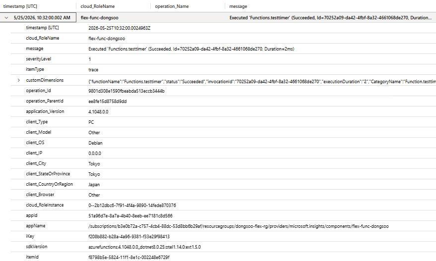
 수준 로그 예시
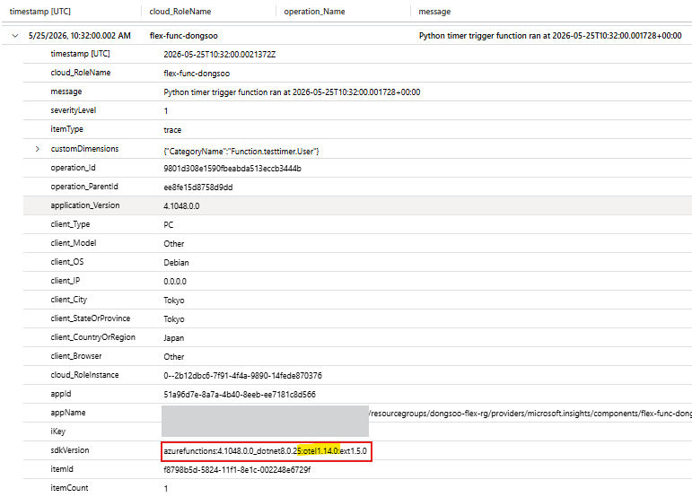

3. 시나리오3. application 상에서만 켬. (host.json 에는 OTEL 설정 없음)
19:56 JST
worker 는 자체적으로 파이프라인을 형성해 host 우회한다.

두 로그가 동시에 생성됨
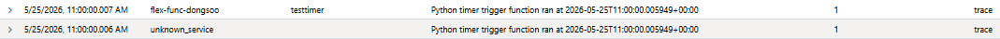

하나는 sdkVersion이 azurefunction으로 
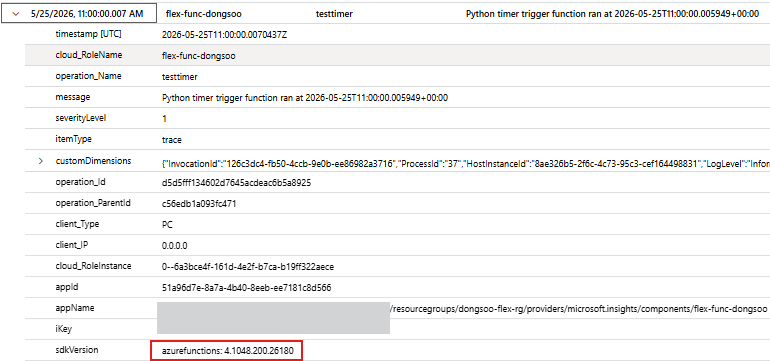

다른 하나는, otel이 있다.
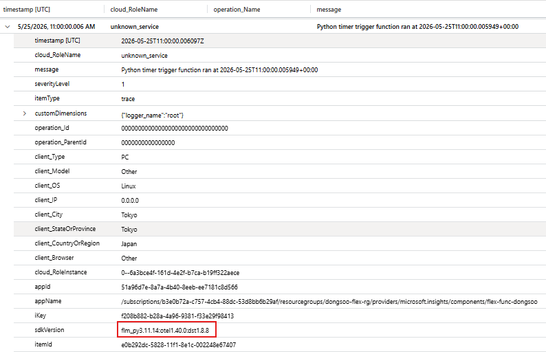

또, Executing (호스트 수준) 의 경우는 azurefunction이 되어있음.
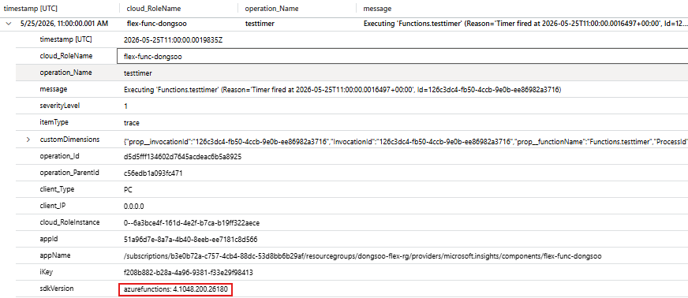


4. 둘다 켜볼까?

호스트 수준의 로그를 보자.
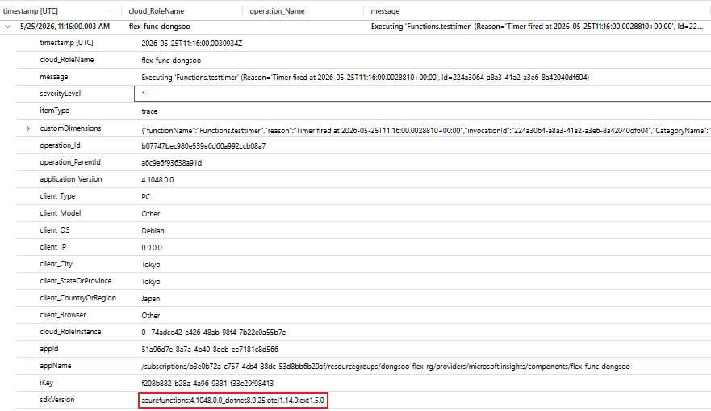

이제 워커 수준의 로그를 보자
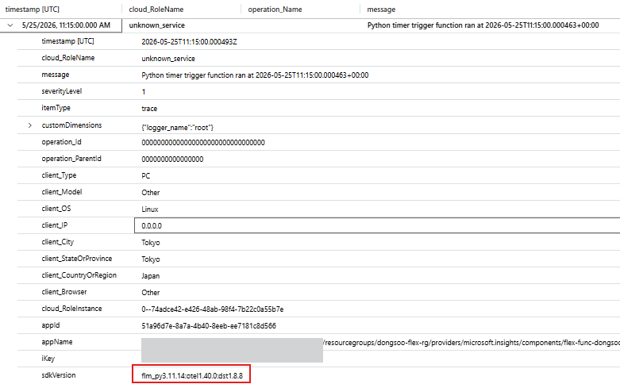

또 다른 호스트 수준의 로그를 보자
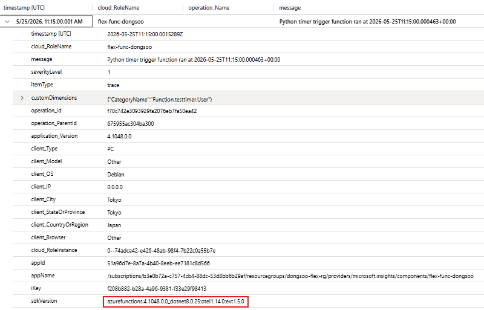


5. 자 이제 환경변수를 추가해보자.
자꾸 Python timer trigger function ran at YYYY-MM-DD .. 라는 로그가 2번씩 호스트 수준에서, 워커수준에서 나타난다.

그이유는 워커수준에서의 로그는 일단 exporter로 otel 파이프라인을 타면서도, 또 호스트 파이프라인도 동시에 타기 떄문이다.

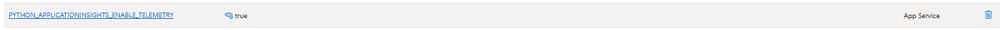

traces
| project-reorder timestamp, cloud_RoleName, operation_Name, message
| where message contains "ran at"
| order by timestamp desc

그동안 동시에 2개씩 생성된 것이 이제 1개씩만 생성됨.

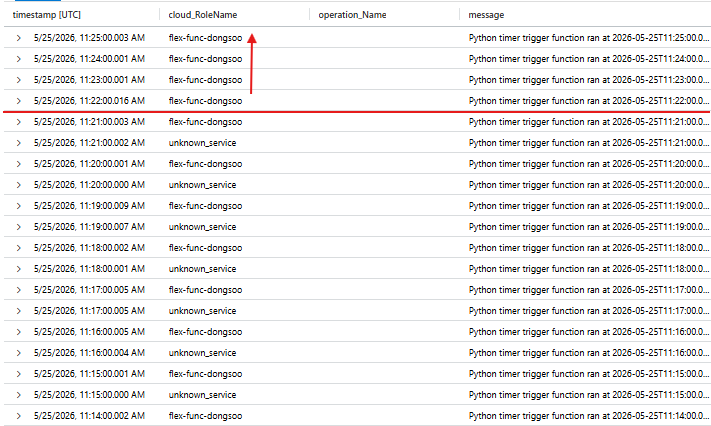

그리고 워커레벨에서 생성되는 거임.
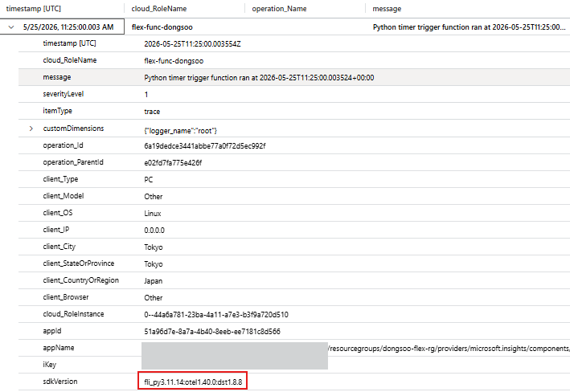